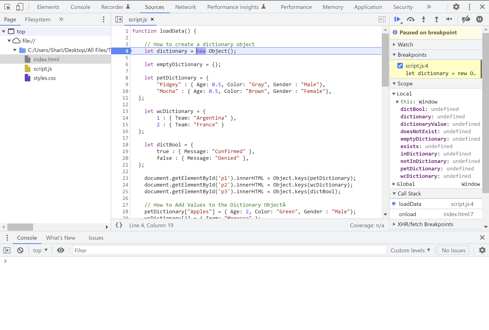

# dictionaries-in-javascript

This contains some examples on how to create a dictionary and access the items inside it.
* How to Create a Dictionary Object
* How to Add Values to the Dictionary Object
* How to Access Values Based on a Key
* How to Iterate Over Each Item in the Dictionary
* How to Check if a Value Exists in the Dictionary
* How to Delete a Value in the Dictionary

## To Run

* Navigate to the JS-Dictionaries folder.
* Click on the index.html file to open it in the web browser.
* If you want to debug it, open the chrome developer tools and put a breakpoint in the script.js file.

